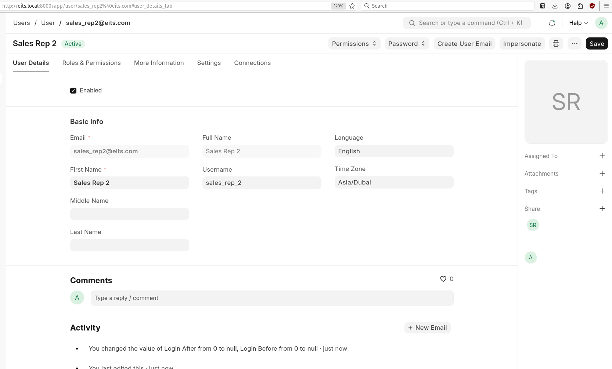
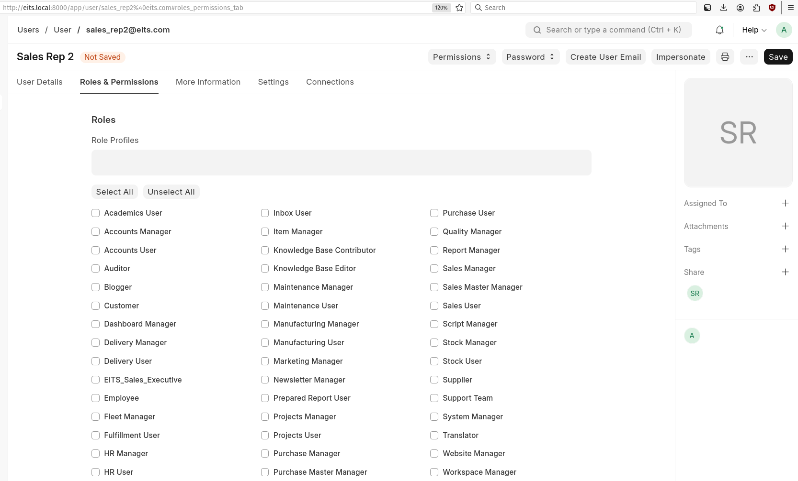
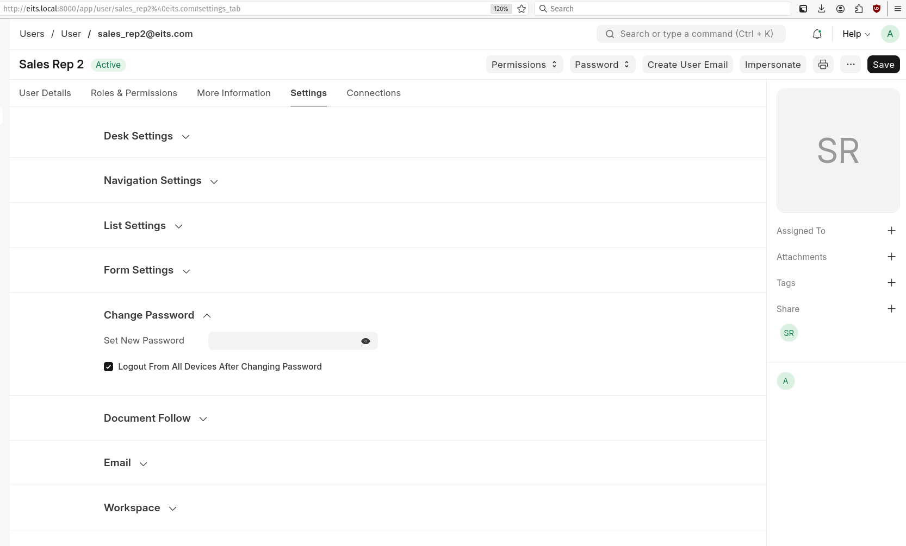
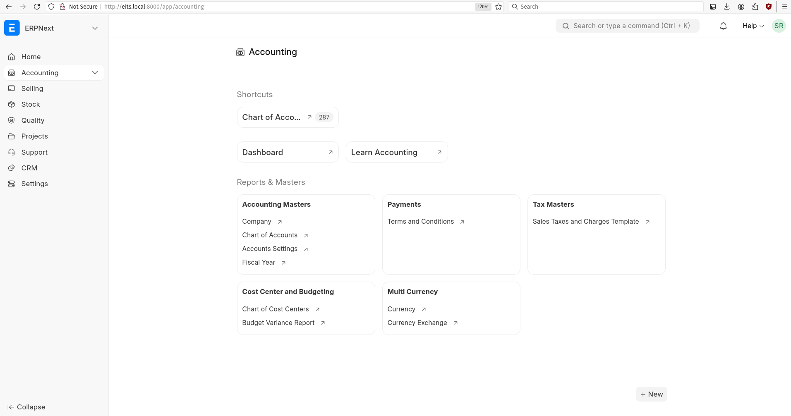

# Create a new user

# Role assignements:

- Here we have assign the roles.
- Role Profile is a group of Roles.

# Update user password

# Post login Dashboard

- We don't have to provide all these access so the roles needs to udpated.

