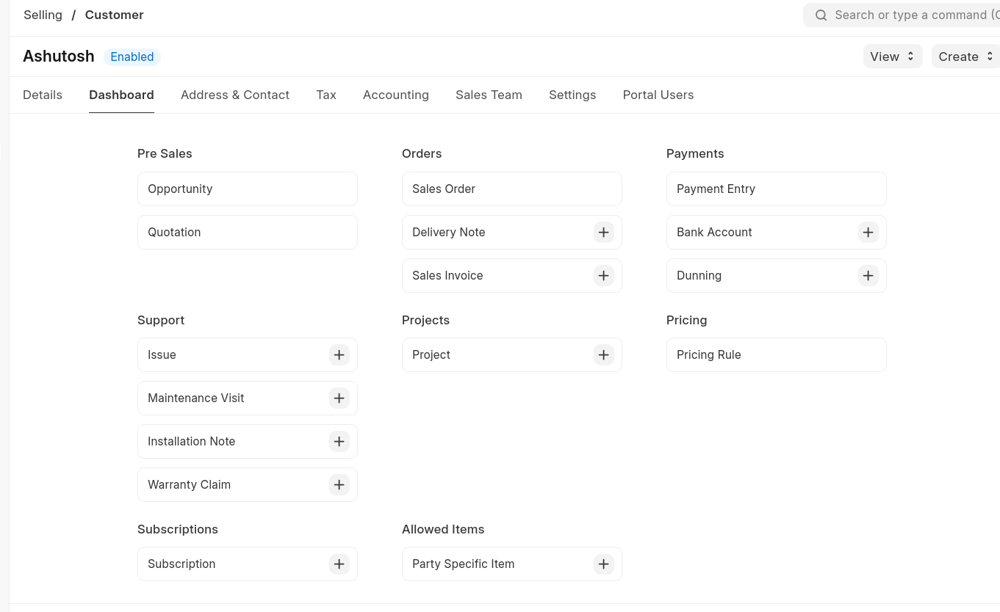
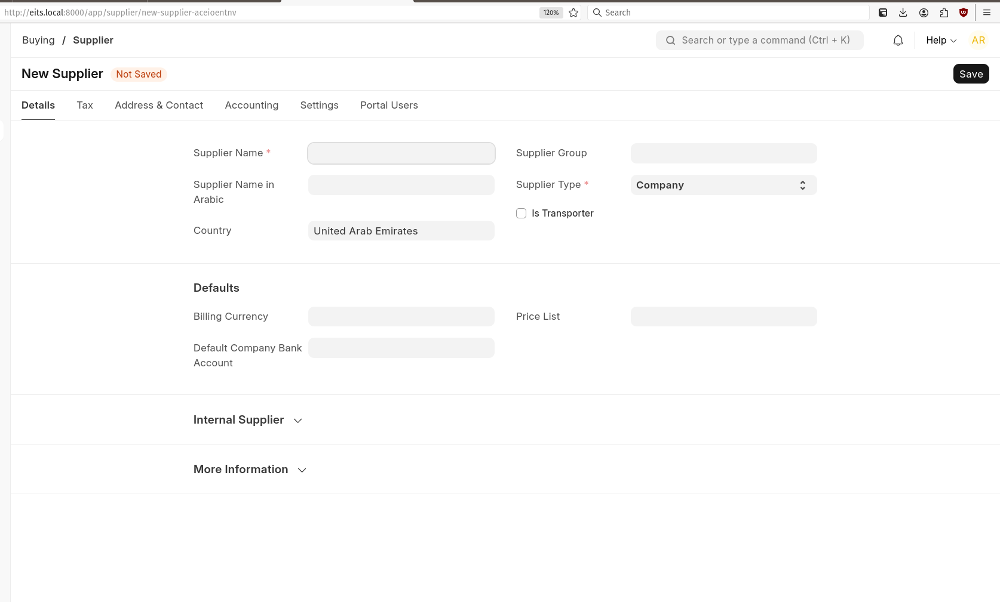
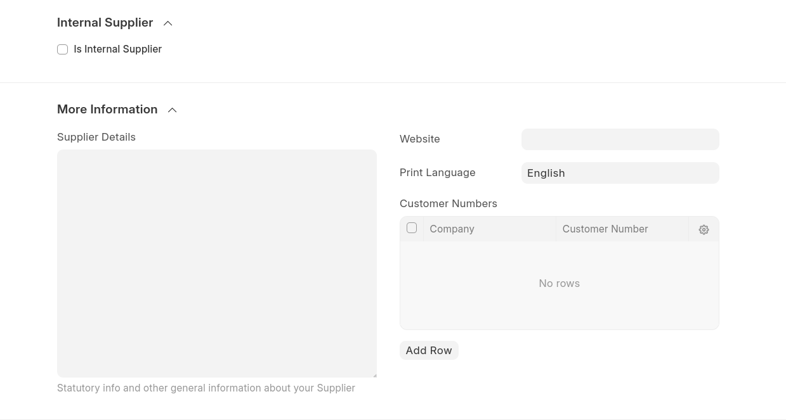
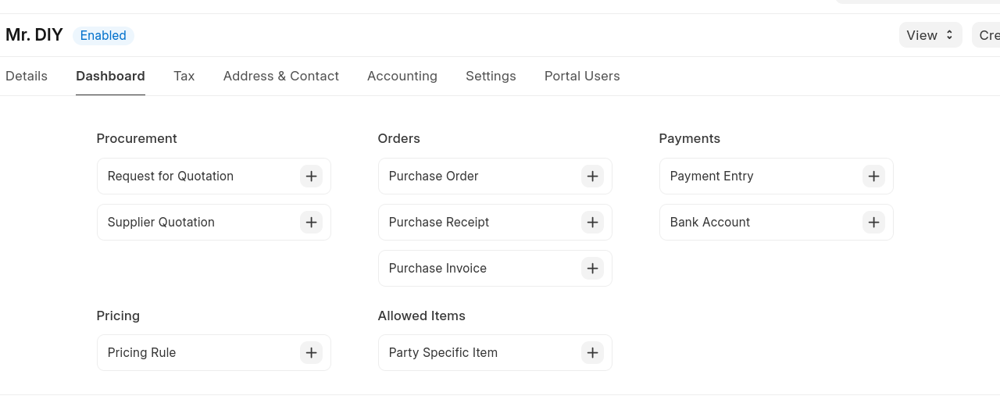
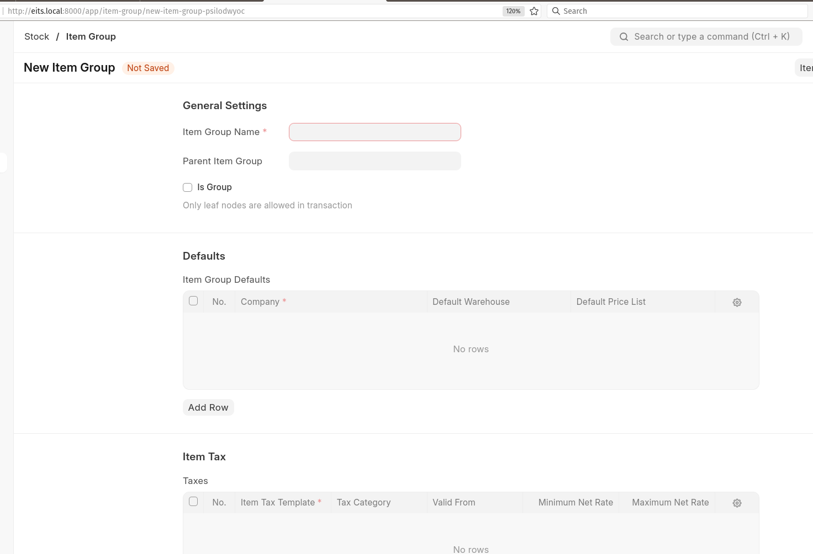
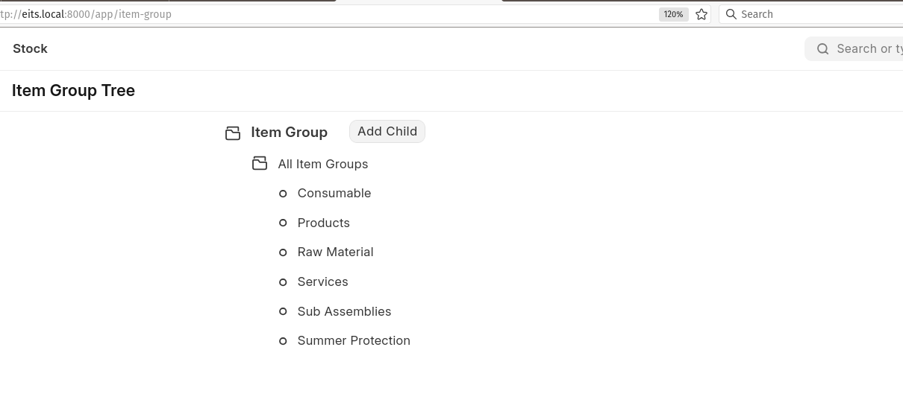

## Development:

- URL: http://eits.local:8001
- Administrator:
  - username: Administrator
  - password: admin

### ERPNext

- URL: http://eits.local:8001/app/home

#### Customer Form

- SNo: 1

- DocType: Customer
- Module: Selling

- URL: http://eits.local:8001/app/customer

###### Attributes:

- Customer name
- Address and contact
- Customer Group
  - Commercial
  - Individual
  - Govt
  - NGO
- Source
  - From Lead
  - From Opportunity
  - From Prospect?
- Billing Currency
- Bank Account
- Default Price List

- Relationships
  - Inquiry,
  - Site Inspection,
  - Quotation,
  - Jobs,
  - Followup,
  - Approval,
  - Invoice,
  - Collection

- Remarks
  - Customer can be created
  - Except Address, all the details about customer can be added.

---

---

#### Supplier Form

- SNo: 2

- DocType: Supplier
- Module: Buying

##### Attributes:

- Supplier Name
- Country
- Supplier Group
  - Distributer
  - Electrical
  - Hardware
  - Local
- Supplier Type
- Is Transporter
- Defaults
  - Billing Currency
  - Default Company Bank Account
  - Price List

- Relationships
  - Inquiry,
  - Site Inspection,
  - Quotation,
  - Jobs,
  - Followup,
  - Approval,
  - Invoice,
  - Collection

---

---

#### Material Category Form

- SNo: 3
- DocType: Item Group
- Module: Stock

- Relationships

  - Material Group,
  - Issue,
  - Receipt,
  - currency,
  - Unit,
  - Dimension

- Remarks:
  - Material category in requirement can be mapped to Item Group
  - Material to be mapped with Item.
  - In Relationships "Material Group" is to be seems as in place of Item group

---

---
