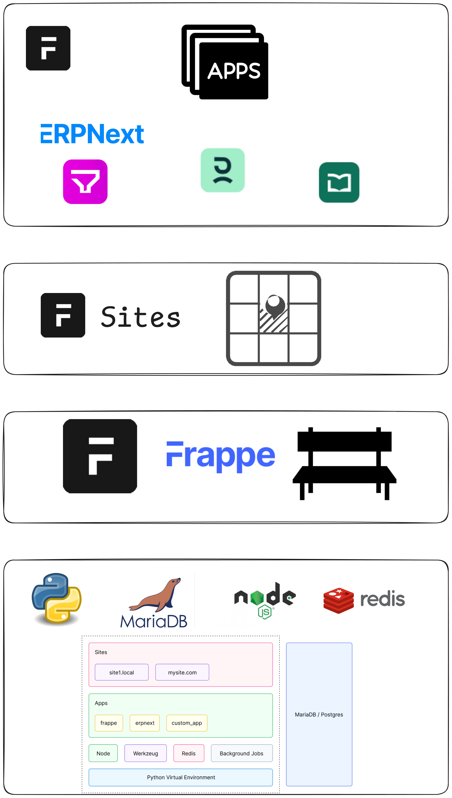

## Manual

## Development Environment




### Bench 

- [Docs](https://docs.frappe.io/framework/v14/user/en/installation#debian--ubuntu)
- [Guide](https://github.com/D-codE-Hub/Guide-to-Install-Frappe-ERPNext-in-Ubuntu-22.04-LTS)


#### Python

```bash
sudo apt-get install python3-dev
```


#### Mariadb
```bash
udo apt-get install software-properties-common
sudo apt install mariadb-server
sudo mysql_secure_installation
```

##### Create a new user for Frappe:


#### Nodejs

```bash
sudo apt install curl 
curl https://raw.githubusercontent.com/creationix/nvm/master/install.sh | bash
source ~/.profile
nvm install 14.15.0  


sudo apt-get install npm

sudo npm install -g yarn
```


#### Bench

```bash
sudo -H pip3 install frappe-bench

bench --version
```


---


#### Starting:

```bash
bench init eits-dev
bench get-app erpnext
bench new-site eits.local 
bench --site eits.local install-app
```
```bash
bench --site eits.local add-to-hosts
```


