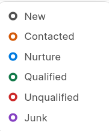
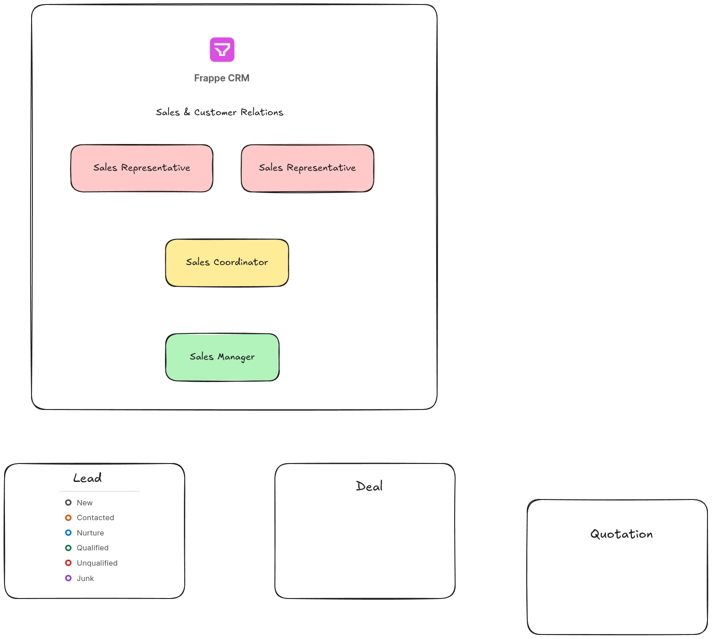
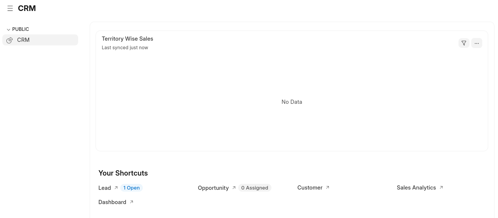
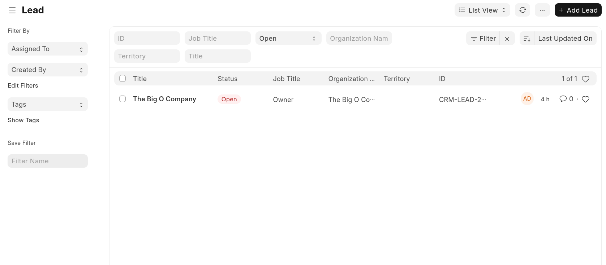
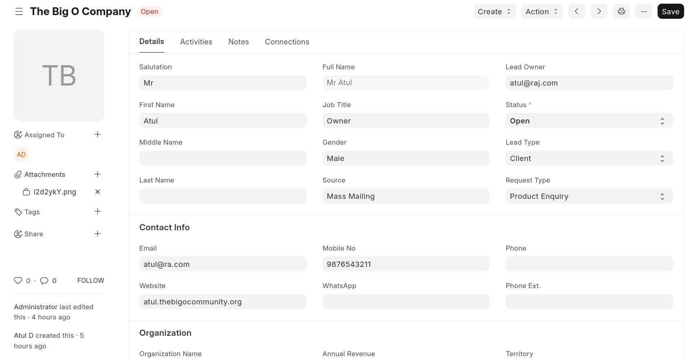
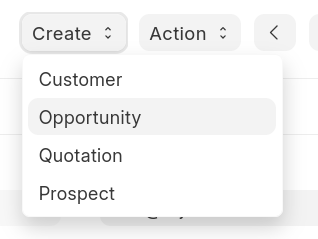
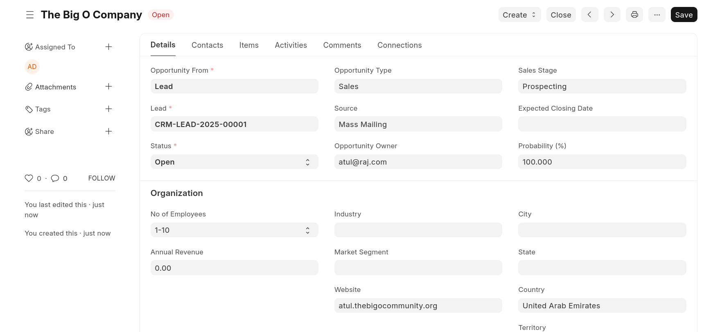
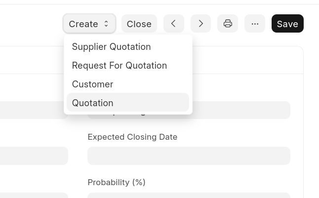
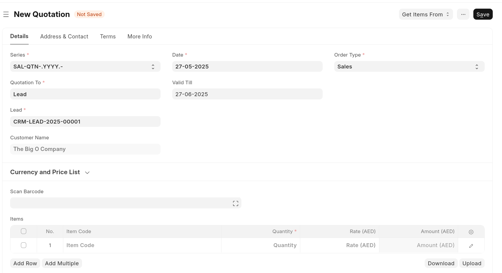
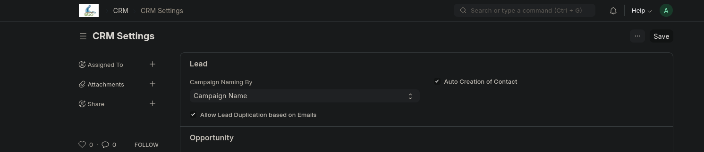

# CRM Application Documentation

## Table of Contents

1. [Overview](#overview)
2. [Documentation and Resources](#documentation-and-resources)
3. [Implementation Approaches](#implementation-approaches)
   - 3.1 [CRM within ERPNext](#crm-within-erpnext)
   - 3.2 [CRM Standalone Application](#crm-standalone-application)
4. [Installation Methods](#installation-methods)
   - 4.1 [Containerized Installation](#containerized-installation)
   - 4.2 [Manual Installation](#manual-installation)
5. [Lead Management](#lead-management)
   - 5.1 [Lead Sources](#lead-sources)
   - 5.2 [Lead Processing Flow](#lead-processing-flow)
6. [User Management](#user-management)
7. [Process Workflow](#process-workflow)

---

## Overview

This document provides comprehensive guidance for implementing and managing a CRM (Customer Relationship Management) application using Frappe/ERPNext framework. The CRM system facilitates lead management, customer relationship tracking, and sales process automation.

## Documentation and Resources

- **Official Documentation**: [Frappe CRM Introduction](https://docs.frappe.io/crm/introduction)
- **Installation Guide**: [Frappe Bench Installation](https://github.com/frappe/bench#installation)
- **Video Tutorial**: [ERPNext CRM Implementation](https://invidious.f5.si/watch?v=vaPN_0fEByk)

## Implementation Approaches

### CRM within ERPNext

This approach integrates CRM functionality within the broader ERPNext ecosystem, providing comprehensive business management capabilities alongside customer relationship management.

**Advantages:**

- Full ERP integration
- Comprehensive business process management
- Unified data structure

### CRM Standalone Application

A dedicated CRM application that focuses specifically on customer relationship management without the broader ERP functionality.

**Advantages:**

- Lightweight deployment
- Focused functionality
- Faster setup and configuration

## Installation Methods

### Containerized Installation

#### Using Frappe Docker

**Prerequisites:**

- Docker installed on your system
- Docker Compose available

**Installation Steps:**

1. Clone the Frappe Docker repository:

   ```bash
   git clone https://github.com/frappe/erpnext
   cd frappe_docker
   ```

2. Start the containerized environment:

   ```bash
   docker compose -f pwd.yml up -d
   ```

3. Access the application:

   - **URL**: http://localhost:8080
   - **Username**: Administrator
   - **Password**: admin

4. Monitor installation status:
   ```bash
   docker compose -f pwd.yml logs -f create-site
   ```

**Note**: The site should be accessible within a few minutes of starting the containers.

### Manual Installation

Direct installation on the operating system without containerization. This method requires manual setup of dependencies and configuration.

**Requirements:**

- Python 3.8+
- Node.js 14+
- MariaDB/PostgreSQL
- Redis

We will be focussing on Manual usage.

Read more about [Manual Implementation](./Manual%20Implementation/readme.md)

## Lead Management




### Lead Sources

The CRM system supports multiple lead generation sources:

- **Existing Customer**: Referrals and repeat business from current customers
- **Advertisements**: Leads generated through marketing campaigns and promotional activities

### Lead Processing Flow

The lead management process follows a structured workflow:

1. **Lead Capture**: Initial contact information collection
2. **Lead Qualification**: Assessment of lead potential and requirements
3. **Lead Assignment**: Distribution to appropriate sales representatives
4. **Follow-up Activities**: Scheduled interactions and communications
5. **Conversion Tracking**: Monitoring lead progression through sales funnel

## User Management

Before implementing the CRM system, ensure proper user roles and permissions are configured:

- **Sales Representatives**: Primary lead handlers and customer interaction points
- **Sales Managers**: Oversight and approval authorities
- **System Administrators**: Technical configuration and maintenance
- **Marketing Team**: Lead generation and campaign management

**Reference**: [Users and Role Definition Guide](../Roles/Users%20and%20Role%20Defination/readme.md)

## Process Workflow

The CRM implementation follows a systematic approach initiated by Sales Representatives:









1. **Lead Generation**: Multiple sources feeding into the system
2. **Lead Capture**: Automated or manual data entry
3. **Lead Qualification**: Scoring and categorization
4. **Opportunity Creation**: Converting qualified leads
5. **Sales Process**: Guided workflow for deal closure
6. **Customer Onboarding**: Post-sale relationship management
7. **Ongoing Relationship Management**: Continuous customer engagement


## Make sure to check :



### Check : 

Allow Lead Duplication based on Emails


## Next Steps

1. Configure user roles and permissions
2. Set up lead sources and capture mechanisms
3. Customize workflow according to business requirements
4. Train users on system functionality
5. Implement reporting and analytics
6. Establish data backup and maintenance procedures

---

_For technical support and advanced configuration, refer to the official Frappe documentation and community resources._
