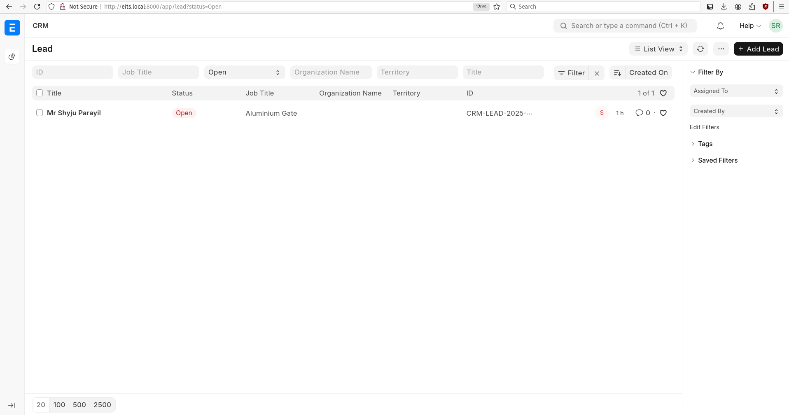
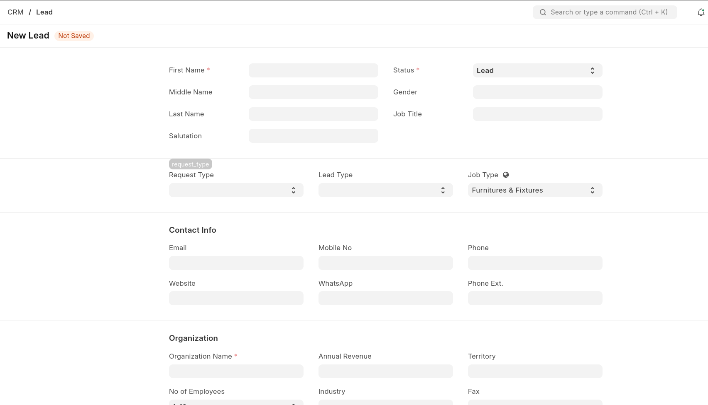

## Sale Representative

### Home Page:

- URL: http://eits.local:8000/app/crm

> The Dashboard chart will be restructed after the [issue](https://discuss.frappe.io/t/error-value-missing-for-workspace-type/147889) resolution.

### Lead

### New Lead

# Lead Status Documentation

## Overview
The Lead Status field in ERPNext tracks the progression of potential customers through your sales pipeline. Each status represents a different stage in the lead management process.

## Status Definitions

### Lead
The initial status when a new lead is created in the system. This represents a potential customer who has shown interest in your products or services but hasn't been contacted yet.

### Open
The lead has been acknowledged and is ready for follow-up activities. Sales representatives can begin reaching out to understand the lead's requirements and qualify their interest level.

### Replied
The lead has responded to your initial contact attempts. This indicates active engagement and that the lead is participating in the conversation about your offerings.

### Opportunity
The lead has been qualified and shows genuine potential for conversion. There's a clear business need identified, and the lead has the authority and budget to make purchasing decisions.

### Lost Quotation
A formal quotation was provided to the lead, but they decided not to proceed with the purchase. This helps track conversion rates and identify areas for improvement in your sales process.

### Interested
The lead has expressed interest in your products or services but hasn't yet reached the opportunity stage. They may need more information or time before making a decision.

### Converted
The lead has successfully been converted into a customer. This typically happens when they make a purchase or sign a contract. The lead record may be linked to a Customer record at this stage.

### Do Not Contact
The lead has requested not to be contacted further, or there are other reasons why communication should cease. This status helps ensure compliance with communication preferences and regulations.

## Usage Guidelines

- Update lead status regularly to maintain accurate pipeline visibility
- Use status changes to trigger automated workflows and notifications
- Review lead status reports to analyze conversion patterns and sales performance
- Ensure proper permissions are set for status changes based on user roles