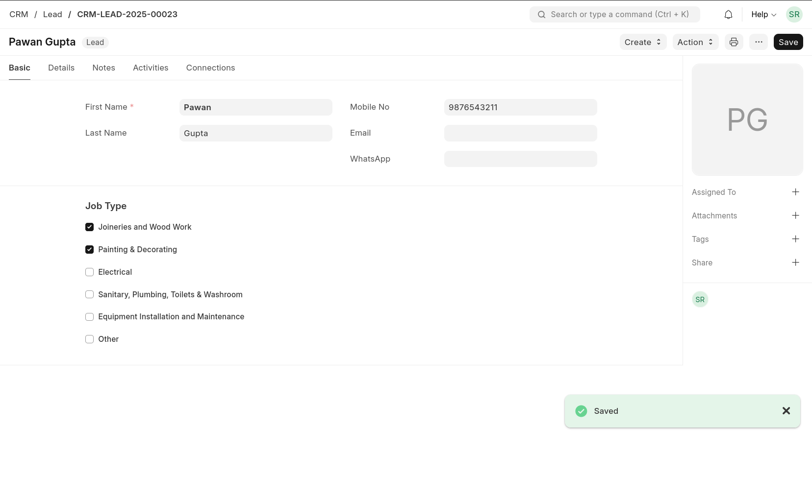
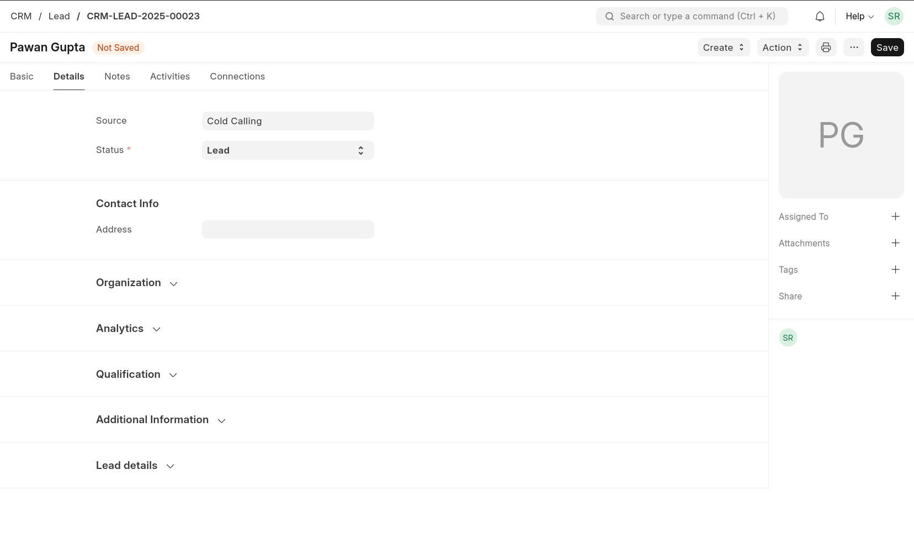
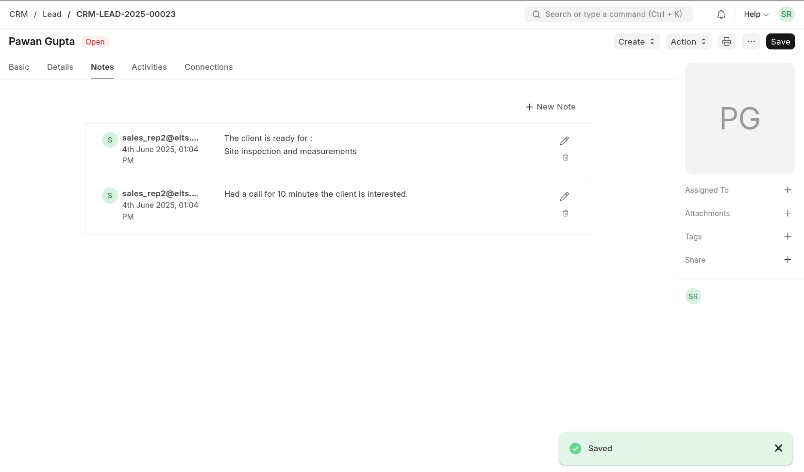
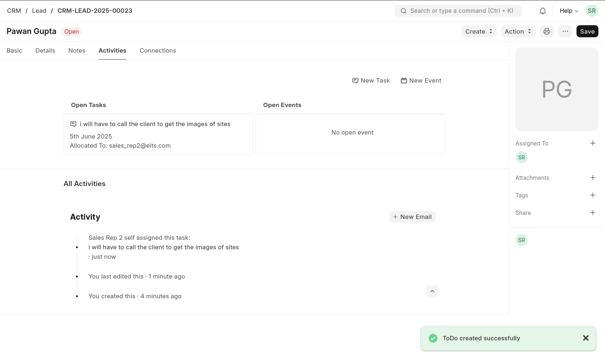
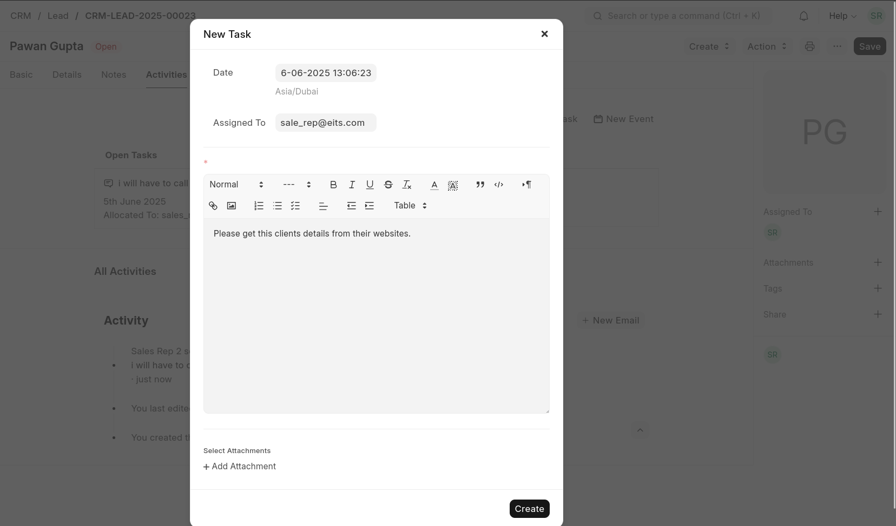
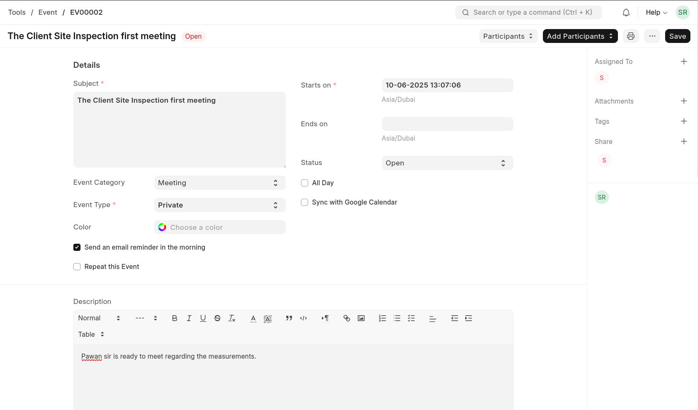
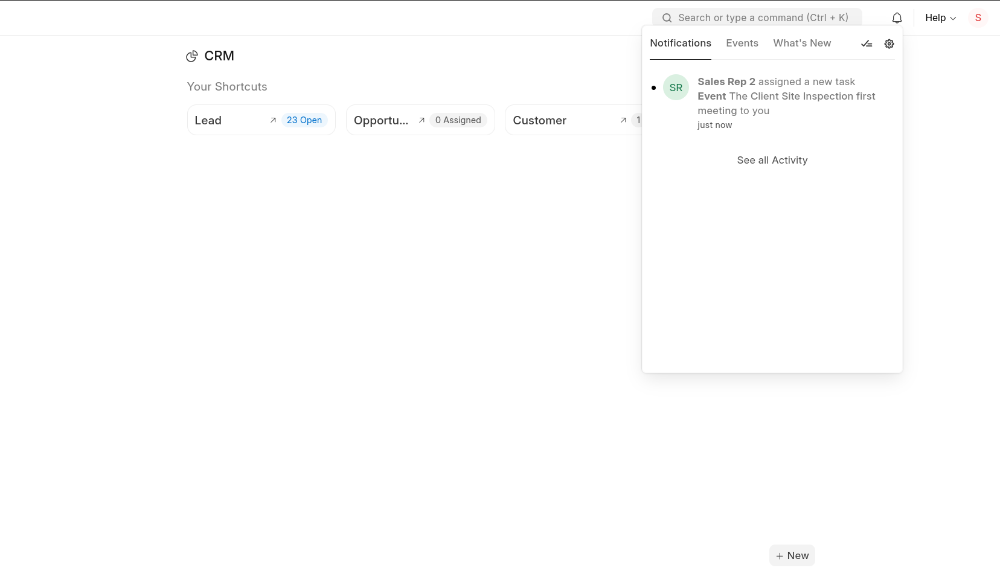
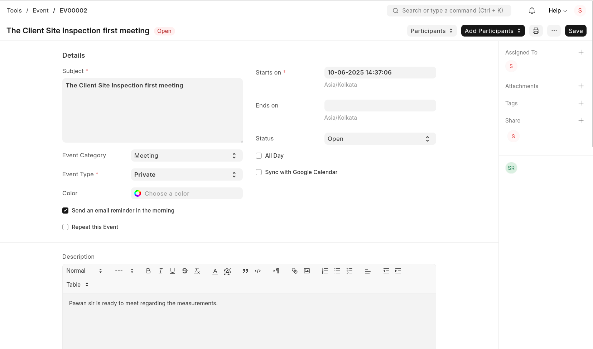
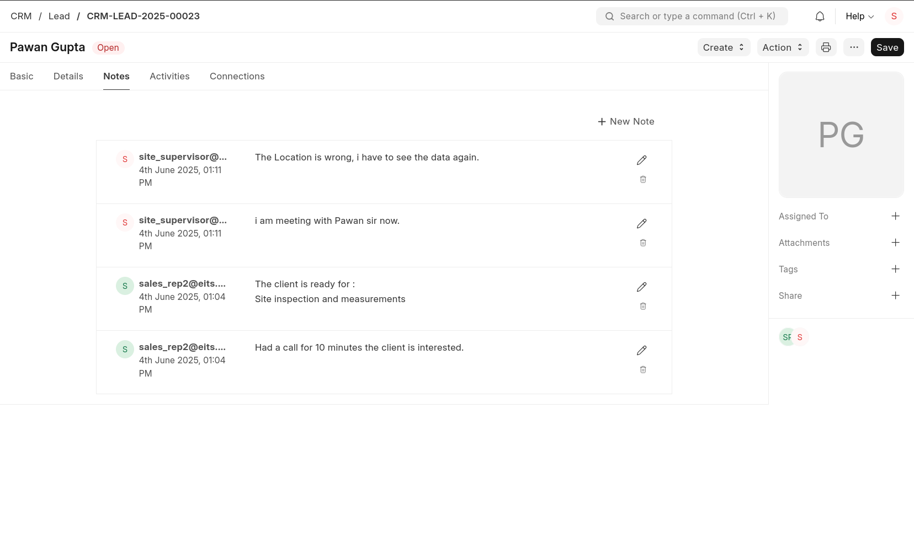
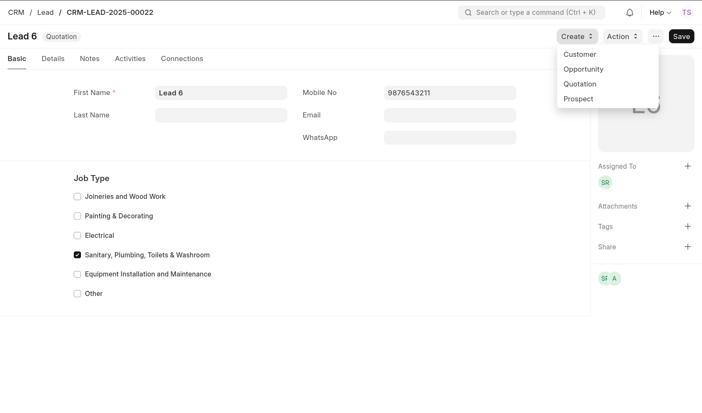

# Create Lead

# Add more Details

# Create Notes as the conversation happens:

# Create Tasks

## Assign tasks to other team members

# Create events

## Assign the event to other team member.

# Site Inspector:

## Site Inspector receives the notification regarding the assignments.

# Site Inspector can view the event and work accordingly

# Site Inspector can create Notes in Lead too

# Technical Specialist

