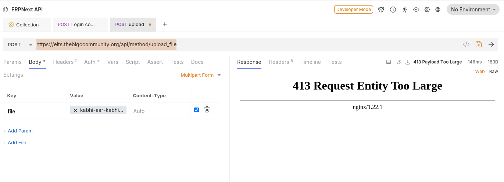

https://eits.thebigocommunity.org/api/method/upload_file



## Error: 

413 Request Entity Too Large
nginx/1.22.1


I can see you're getting a "413 Request Entity Too Large" error when trying to upload a file to your ERPNext API. This means the file you're trying to upload exceeds the server's configured limits.

Here are the key areas to check and modify to increase upload limits:

## 🏰 The Royal Decree: Increasing Upload Limits ⚔️

### 1. **Nginx Configuration** 📜
The mighty Nginx guardian is likely blocking your large files. You need to adjust the `client_max_body_size` directive:

```nginx
# In your nginx.conf or site-specific config
server {
    ...
    client_max_body_size 100M;  # Increase this value
    ...
}
```

After making changes, restart Nginx:
```bash
sudo systemctl reload nginx
```

### 2. **Frappe/ERPNext Site Config** 🧙‍♀️
In your site's configuration, you may need to set:

```python
# In your site_config.json
{
    "max_file_size": 104857600,  # 100MB in bytes
    "file_size": 104857600
}
```

### 3. **PHP Configuration** (if applicable) 🔮
If your setup involves PHP, check these settings in `php.ini`:

```ini
upload_max_filesize = 100M
post_max_size = 100M
max_execution_time = 300
max_input_time = 300
memory_limit = 256M
```

### 4. **System-level Limits** ⚡
For very large files, you might also need to check:

```bash
# Check current limits
ulimit -a

# Increase file size limits if needed
ulimit -f unlimited
```

### 5. **ERPNext Bench Configuration** 🏴‍☠️
You can also try setting this via bench:

```bash
bench set-config -g max_file_size 104857600
bench restart
```

## Quick Troubleshooting Spells 🪄

1. **Check your current file size** - Make sure you know how large your file actually is
2. **Test with smaller files** - Verify the endpoint works with smaller uploads
3. **Check server logs** - Look at both Nginx and ERPNext logs for more specific error details
4. **Restart services** - After making config changes, restart Nginx, and your ERPNext services

The most common culprit is usually the Nginx `client_max_body_size` setting, so start there! 

What's the size of the file you're trying to upload, and which setup are you running (self-hosted, cloud, etc.)?


--- 

Didn't helped much, i don't see the request hitting the ERP server, this is not being passed forward from Nginx itself. 


Ah, you're right! If the request isn't even reaching the ERP server, Nginx is rejecting it at the gateway level. Let's focus specifically on Nginx configuration.

## 🏰 The Nginx Fortress is Blocking Your Upload! ⚔️

### 1. **Find Your Nginx Config File** 🗺️
First, locate which config file is actually being used:

```bash
# Find the main nginx config
sudo nginx -t

# Check if there's a site-specific config
ls /etc/nginx/sites-enabled/
ls /etc/nginx/conf.d/
```

### 2. **Check Current Nginx Settings** 🔍
Look for your ERPNext site configuration. It's likely in:
- `/etc/nginx/sites-enabled/your-site`
- `/etc/nginx/conf.d/your-site.conf`

### 3. **Add/Modify These Directives** 📜

In your ERPNext site's Nginx config block:

```nginx
server {
    # ... your existing config ...
    
    # The main spell - increase body size limit
    client_max_body_size 100M;
    
    # Additional protective enchantments
    client_body_timeout 120s;
    client_header_timeout 120s;
    
    # For the specific upload endpoint
    location /api/method/upload_file {
        client_max_body_size 100M;
        proxy_pass http://your-backend;
        proxy_set_header Host $host;
        proxy_set_header X-Real-IP $remote_addr;
        proxy_set_header X-Forwarded-For $proxy_add_x_forwarded_for;
        proxy_set_header X-Forwarded-Proto $scheme;
        
        # Increase timeouts for large uploads
        proxy_connect_timeout 300;
        proxy_send_timeout 300;
        proxy_read_timeout 300;
        send_timeout 300;
    }
    
    # ... rest of your config ...
}
```

### 4. **Test Nginx Config & Reload** 🧪
```bash
# Test the configuration
sudo nginx -t

# If test passes, reload
sudo nginx -s reload
# OR
sudo systemctl reload nginx
```

### 5. **Debug with Nginx Logs** 🕵️‍♀️
Check what Nginx is actually saying:

```bash
# Watch nginx error logs in real-time
sudo tail -f /var/log/nginx/error.log

# Check access logs too
sudo tail -f /var/log/nginx/access.log
```

### 6. **Quick Test Command** ⚡
Test if Nginx is now accepting larger requests:

```bash
# Test with a large dummy file
curl -X POST \
  -F "file=@/path/to/large/file" \
  -v \
  https://your-domain.com/api/method/upload_file
```

## Common Nginx Gotchas 🪤

1. **Multiple `client_max_body_size` declarations** - Make sure you don't have conflicting values in different blocks
2. **Missing from the right location block** - Ensure it's in the server block or the specific location that handles uploads
3. **Cached config** - Sometimes Nginx doesn't reload properly, try a full restart: `sudo systemctl restart nginx`

Can you share your current Nginx config for the ERPNext site? That way I can spot exactly what might be missing! 🏴‍☠️


---

 Didn't helped either, updated eits.thebigocommunity.org


 Now changed the main:

 Perfect! The logs clearly show the issue. Nginx is rejecting your ~48MB file because `client_max_body_size` is still set too low (probably at the default 1MB).

## 🏰 The Curse is Clear - Let's Break It! ⚔️

Your file is **48,048,940 bytes (~48MB)** and Nginx is saying "Nope, too big!" 

Let's find and fix your Nginx config:

### 1. **Find Your Site Config** 🗺️
```bash
# Check what's in sites-available
ls -la /etc/nginx/sites-available/

# Look for your site config (likely named after your domain)
sudo nano /etc/nginx/sites-available/eits.thebigocommunity.org
# OR it might be named something like 'default' or 'frappe'
```

### 2. **Show Me Your Current Config** 🔍
Can you run this and share the output?
```bash
sudo cat /etc/nginx/sites-available/*
```

### 3. **Quick Fix - Add to Main Config** ⚡
If you can't find the specific site config, add this to the main nginx config:

```bash
sudo nano /etc/nginx/nginx.conf
```

Add this line inside the `http` block:
```nginx
http {
    # ... existing config ...
    client_max_body_size 100M;
    # ... rest of config ...
}
```

### 4. **Test & Reload** 🧪
```bash
# Test config
sudo nginx -t

# Reload if test passes
sudo nginx -s reload
```

### 5. **Verify the Fix** ✅
Try your upload again and watch the logs:
```bash
sudo tail -f /var/log/nginx/error.log
```

The error should disappear and you should see the request actually reaching your ERPNext server.

## 🪄 Most Likely Scenario
Your ERPNext was probably set up with a standard nginx config that has the default 1MB limit. We just need to find that config file and bump it up to 100M.

Can you share the contents of your nginx sites-available directory and the config file? That way I can give you the exact fix! 🏴‍☠️


## Changed the main helped. 

- Main : config: /etc/nginx/nginx.conf

     client_max_body_size 100M;


- Site level config: /etc/nginx/site-available/eits.thebigocommunity.org


    client_max_body_size 100M;
    client_body_timeout 120s;
    client_header_timeout 120s;

    increased timeout to 300
 
- Inside Frappe, config: nginx.conf


