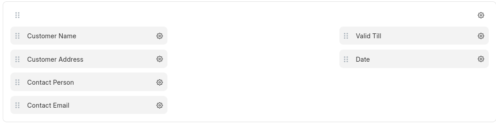
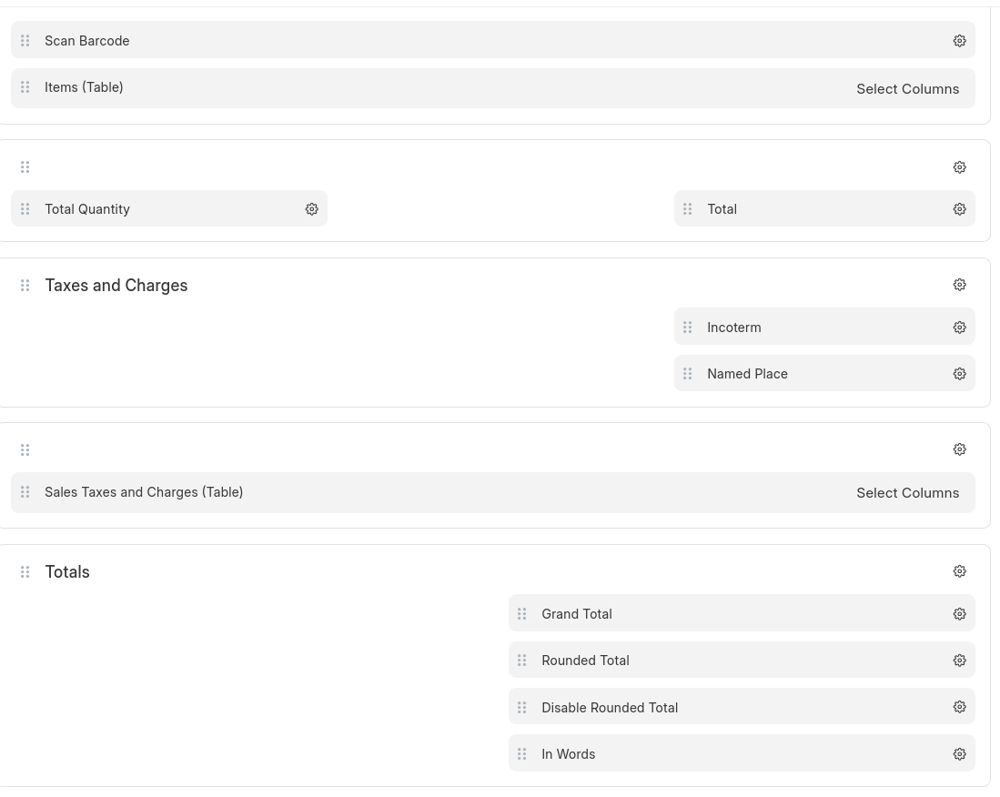
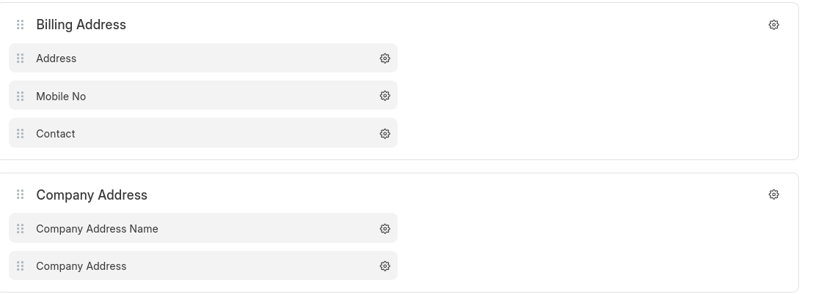
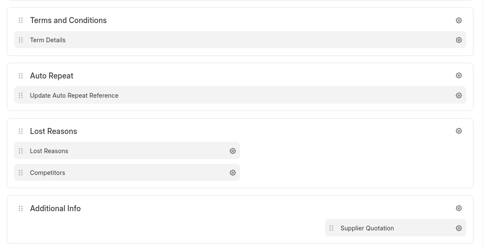

## Letter head

- Company Logo


### Header

```html
<div style="display: flex; justify-content: space-between; align-items: center; padding: 20px; border-bottom: 1px solid #ddd; font-family: Arial, sans-serif; width: 100%;">
    <div style="display: flex; flex-direction: column; align-items: flex-start;">
        
        <div style="color: #0059a2; font-weight: bold; font-size: 16px; margin-bottom: 5px;">Eco Innovative Technical Services LLC</div>
        <div style='direction: rtl; font-family: "Traditional Arabic", Arial, sans-serif; font-size: 14px;'>بيكو انوفيتيف للخدمات الفنية ش.ذ.م.م</div>
    </div>
    <div style="text-align: right; line-height: 1.5;">
        <div>Dubai, Y13, S11</div>
        <div>International City</div>
        <div>Po Box 64135</div>
        <div>Tel: 042432187</div>
        <div>Email: eitsdxb@gmail.com</div>
        <div>www.eitsuae.com</div>
    </div>
</div>
```


### Footer

```html

<div style="display: flex; justify-content: space-between; padding: 15px 20px; border-top: 1px solid #ddd; font-family: Arial, sans-serif; font-size: 12px; color: white; width: 100%; margin-top: 20px; background-color: #0059a2;">
    <div style="text-align: left;">
        <div style="font-weight: bold; margin-bottom: 3px;">Eco Innovative Technical Services LLC</div>
        <div>Dubai, International City | Tel: 042432187 | Email: eitsdxb@gmail.com</div>
    </div>
    <div style="text-align: right;">
        <div style='direction: rtl; font-family: "Traditional Arabic", Arial, sans-serif;'>بيكو انوفيتيف للخدمات الفنية ش.ذ.م.م</div>
        <div>www.eitsuae.com | Page <span style="display: inline-block; width: 20px; text-align: center;">1</span> of <span style="display: inline-block; width: 20px; text-align: center;">1</span></div>
    </div>
</div>

```

---


## Print Format


### Heading

```html
<div class="print-heading" style="text-align: center; position: relative; margin-bottom: 20px;">
    <h2 style="font-size: 28px; font-weight: bold; text-decoration: underline; margin-bottom: 15px;">Quotation</h2>
    <hr style="margin-bottom: 15px;">
    <small class="ref-number" style="position: absolute; right: 0; bottom: 0; font-size: 14px;">Ref: {{ doc.name }}</small>
</div>
```


### Customer Contact




### Starting annotation

```html
<div style="font-family: Arial, sans-serif;">
  <p>Dear Sir / Mam,</p>
  
  <p>Thank you for your enquiry and providing opportunity to quote you on the Job. Below is our best quote for your perusal. Hope this will be in line with your requirement with consideration of our quality services and timely work completion.</p>
  
  <p><strong>Our Estimated Price</strong></p>
  
  <p>Our best quote with our quality services for this Work is as below, hope this is in line with your requirement.</p>
</div>
```

### Items and Amount details (Brief)




### Addresses




### Static data


```html
 <div style=" font-family: Arial, sans-serif; line-height: 1.5; background-color: #f9f9f9; max-width: 100%; box-sizing: border-box;">
    <h3 style="margin-top: 0; margin-bottom: 10px; font-size: 16px; font-weight: bold; color: #000;">Disclaimer:</h3>
    <p style="margin: 0; font-size: 14px; color: #333;">
      Works mentioned/quoted above are only limited to the provided photos/locations pertaining to photos within appendix A / site visit discussions. Any additions will be quoted separately as if to be done. For tiles/cladding/paint project approved products/RAL/Manufacturer/local supplier/technical details to be provided by client or similar products will be used. EITS will not hold responsible for any slight differences due to usage of similar products (in absence of information from client end).
    </p>
  </div>

```


```html
<div class="bank-details">
    <h4>Bank Details:</h4>
    <p>Bank Name: Your Bank Name</p>
    <p>Account Number: XXXXXXXXXX</p>
    <p>IFSC Code: XXXXXXXX</p>
    <p>Account Name: Your Company Name</p>
</div>
```


```html
  <div style="font-family: Arial, sans-serif;">
    <h4 style=" padding-bottom: 10px;">Scope of work Client</h4>
    <ol style="line-height: 1.6;">
      <li>Access permit / Pass, any design related approval if applicable.</li>
      <li>Welfare facilities for workforce. Utilities like power supply, light and water etc....</li>
      <li>Equipment, power shutdown and restart shall be in client supervision and under his responsibility if applicable.</li>
    </ol>
  </div>
```

### Terms 





### Closing annotation

```html

 <div style="font-family: Arial, sans-serif; line-height: 1.6;">
    <p style="margin-bottom: 15px; font-size: 15px;">
      Should there be a need for further clarification, please do communicate to us. It would be our privilege to assist you.
    </p>
    
    <p style="margin-bottom: 20px; font-size: 15px;">
      Thanking you,
    </p>
    
    <p style="margin-bottom: 15px; font-weight: bold; font-size: 16px;">
      For Eco Innovative Technical Services LLC
    </p>
    
    <!--<div style="margin-bottom: 15px;">-->
    <!--  -->
    <!--</div>-->
    
    <p style="margin-bottom: 5px; font-size: 15px;">
      S P Singh M D <a href="tel:0501768742" style="color: #0066cc; text-decoration: none;">Mob: 0501768742</a>
    </p>
  </div>

```


## [Back to Implementation](../readme.md)
