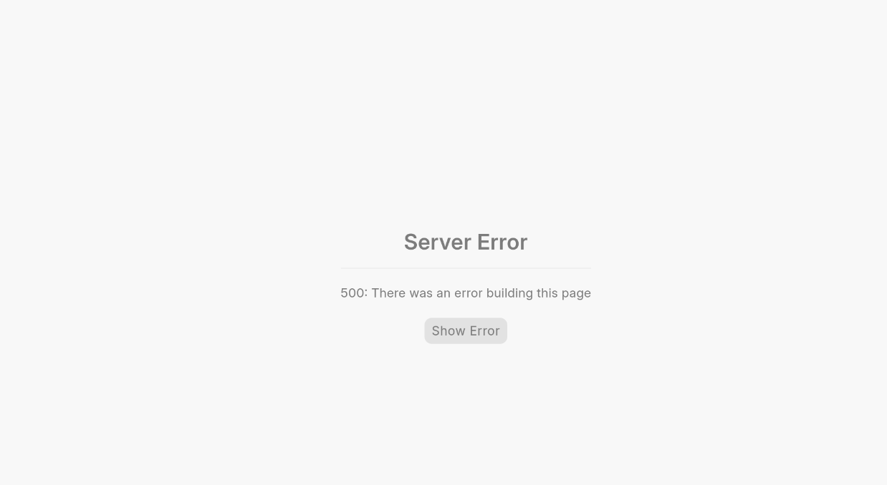

- I created a user account
- There is only Employee Profile
- No Access to module is defined

- By this I am logging into the ERP
- Getting ERROR

- That means there is no home page to access. 

- I have give Eits App module access to the User.

- Eits App does not have a dashboard 
    - Maybe that's why there is the same error.

- I now have added Desk module access to user.
    - Still the same
- I have added Portal too
    - Still the same 

- Okay so
    - Eits App
    - Desk
    - These are not enough
    - There has to be another Module with Dashboard
        - Like
            - CRM

---

- Create Role
    - Role Permission Manager
        - Roles 
