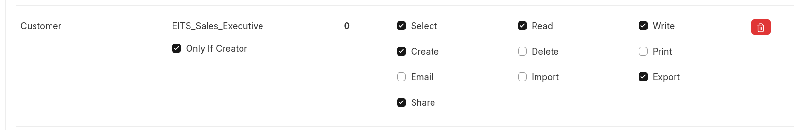
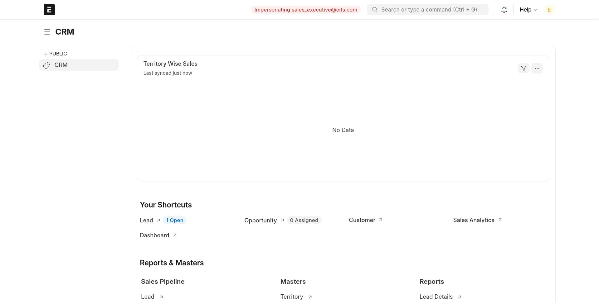

# EITS ERPNext Users & Roles Implementation Guide

## Overview

This document provides a comprehensive guide for implementing user management and role-based access control in ERPNext for Eco Innovative Technical Services LLC (EITS). The structure aligns with the company's operational requirements and ensures appropriate access levels across all departments.

## Department Structure & Role Definitions

### 1. Executive Management Department

#### Chief Executive Officer / Managing Director

- **Role Name:** `EITS_CEO`
- **Access Level:** Full System Access
- **Key Permissions:**
  - Complete financial oversight
  - Strategic reporting access
  - System configuration rights
  - All module access without restrictions

#### Operations Manager

- **Role Name:** `EITS_Operations_Manager`
- **Access Level:** Operations + Limited Financial
- **Key Permissions:**
  - Project management oversight
  - Resource allocation control
  - Quality control access
  - Limited financial reporting

### 2. Sales & Customer Relations Department

#### Sales Manager

- **Role Name:** `EITS_Sales_Manager`
- **Access Level:** Sales Management + CRM Full Access
- **Key Permissions:**
  - Complete CRM module access
  - Sales analytics and reporting
  - Customer data management
  - Quotation approval authority
  - Lead assignment and oversight

#### Sales Executive / Business Development

- **Role Name:** `EITS_Sales_Executive`
- **Access Level:** CRM Operational Access
- **Key Permissions:**
  - Lead capture and management
  - Customer interaction tracking
  - Quotation creation (approval required)
  - Follow-up management
  - Site visit scheduling

#### Customer Service Representative

- **Role Name:** `EITS_Customer_Service`
- **Access Level:** Customer Support Access
- **Key Permissions:**
  - Customer inquiry management
  - Basic customer information access
  - Communication tracking
  - Service request logging

### 3. Operations & Project Management Department

#### Project Manager

- **Role Name:** `EITS_Project_Manager`
- **Access Level:** Project Management Full Access
- **Key Permissions:**
  - Project creation and management
  - Resource allocation
  - Timeline management
  - Progress tracking and reporting
  - Team coordination access

#### Site Supervisor / Field Engineer

- **Role Name:** `EITS_Site_Supervisor`
- **Access Level:** Field Operations Access
- **Key Permissions:**
  - Project status updates
  - Material requisition
  - Quality control reporting
  - Time tracking
  - Mobile app access

#### Technical Specialist

- **Role Name:** `EITS_Technical_Specialist`
- **Access Level:** Technical Documentation Access
- **Key Permissions:**
  - Technical specification management
  - BOM creation and modification
  - Engineering documentation
  - Quality standards maintenance

### 4. Finance & Accounting Department

#### Finance Manager / Accountant

- **Role Name:** `EITS_Finance_Manager`
- **Access Level:** Financial Management Full Access
- **Key Permissions:**
  - Complete accounting module access
  - Financial reporting and analysis
  - Budget management
  - Payment processing approval
  - Tax and compliance management

#### Accounts Executive

- **Role Name:** `EITS_Accounts_Executive`
- **Access Level:** Accounting Operations Access
- **Key Permissions:**
  - Invoice creation and management
  - Payment entry processing
  - Basic financial reporting
  - Expense tracking
  - Vendor payment management

### 5. Procurement & Inventory Department

#### Procurement Manager

- **Role Name:** `EITS_Procurement_Manager`
- **Access Level:** Procurement Full Access
- **Key Permissions:**
  - Supplier management
  - Purchase order approval
  - Inventory oversight
  - Cost analysis and reporting
  - Vendor evaluation

#### Inventory Controller

- **Role Name:** `EITS_Inventory_Controller`
- **Access Level:** Inventory Management Access
- **Key Permissions:**
  - Stock management
  - Material receipt processing
  - Inventory tracking and reporting
  - Reorder point management
  - Physical stock verification

#### Purchase Executive

- **Role Name:** `EITS_Purchase_Executive`
- **Access Level:** Purchase Operations Access
- **Key Permissions:**
  - Purchase requisition creation
  - Quotation comparison
  - Purchase order creation (approval required)
  - Supplier communication

### 6. Human Resources Department

#### HR Manager

- **Role Name:** `EITS_HR_Manager`
- **Access Level:** HR Management Full Access
- **Key Permissions:**
  - Employee management
  - Payroll processing
  - Leave management
  - Performance tracking
  - HR reporting and analytics

#### HR Executive

- **Role Name:** `EITS_HR_Executive`
- **Access Level:** HR Operations Access
- **Key Permissions:**
  - Employee data entry
  - Leave processing
  - Attendance tracking
  - Basic HR reporting

## Implementation Steps in ERPNext

### Step 0: Create a Role Profile

### Step 1: Create Custom Roles

1. Navigate to **Setup > Users and Permissions > Role**
2. Create each role listed above with appropriate naming conventions
3. Configure role properties:
   - Set role type (Desk User for office staff, Website User for limited access)
   - Define home page for each role
   - Set restrictions as needed

### Step 2: Configure Role Permissions

For each role, configure permissions across relevant doctypes:

#### Common Doctypes to Configure:

- **Customer:** Lead, Customer, Contact, Address
- **Sales:** Quotation, Sales Order, Sales Invoice
- **Projects:** Project, Task, Timesheet, Project Update
- **Purchasing:** Supplier, Purchase Order, Purchase Receipt, Purchase Invoice
- **Stock:** Item, Stock Entry, Delivery Note, Material Request
- **Accounts:** Payment Entry, Journal Entry, Account, Cost Center
- **HR:** Employee, Attendance, Leave Application, Salary Structure

#### Permission Levels:

- **Read:** View access only
- **Write:** Create and modify records
- **Create:** Permission to create new records
- **Delete:** Permission to delete records
- **Submit:** Permission to submit documents
- **Cancel:** Permission to cancel submitted documents
- **Amend:** Permission to amend cancelled documents

### Step 3: Set Up User Restrictions

Configure user-specific restrictions based on business requirements:

#### Document Level Restrictions:

- **Territory Based:** Restrict users to specific geographical areas
- **Company Based:** Multi-company access control
- **Cost Center Based:** Department-wise financial access
- **Customer Group Based:** Customer category access control

#### Field Level Restrictions:

- Sensitive financial information
- Confidential customer data
- Strategic business information

### Step 4: Create User Accounts

1. Navigate to **Setup > Users and Permissions > User**
2. Create user accounts for each department member
3. Assign appropriate roles to each user
4. Configure user-specific settings:
   - Default company and cost center
   - Language and timezone preferences
   - Email and communication settings

### Step 5: Configure Workflow States

Set up approval workflows for critical business processes:

#### Sales Process Workflow:

- Lead → Qualified Lead → Quotation → Sales Order
- Approval requirements based on quotation value

#### Purchase Process Workflow:

- Material Request → Purchase Order → Purchase Receipt → Purchase Invoice
- Multi-level approvals based on purchase value

#### Project Process Workflow:

- Project Planning → Execution → Quality Check → Completion
- Status updates and milestone approvals

## Role-Based Dashboard Configuration

### Management Dashboard

- Key performance indicators (KPIs)
- Revenue and profitability metrics
- Project status overview
- Team performance summary

### Sales Dashboard

- Lead pipeline visualization
- Conversion rate analysis
- Customer interaction summary
- Target vs. achievement tracking

### Operations Dashboard

- Active project status
- Resource utilization metrics
- Quality control indicators
- Timeline adherence tracking

### Finance Dashboard

- Cash flow management
- Outstanding payments
- Budget vs. actual analysis
- Expense tracking summaries

## Security Best Practices

### Password Policies

- Minimum password complexity requirements
- Regular password change enforcement
- Two-factor authentication for sensitive roles

### Session Management

- Automatic session timeout configuration
- Concurrent session limitations
- Login attempt monitoring

### Audit Trail

- User activity logging
- Document change tracking
- Access attempt monitoring
- Regular security audits

## Training and Documentation Requirements

### Role-Specific Training Modules

- System navigation and basic functionality
- Department-specific workflow training
- Reporting and analytics usage
- Mobile application usage (for field staff)

### User Documentation

- Role-specific user manuals
- Quick reference guides
- Video tutorials for complex processes
- FAQ and troubleshooting guides

## Maintenance and Review

### Regular Review Schedule

- Monthly role permission review
- Quarterly user access audit
- Annual role structure evaluation
- Continuous process improvement

### Change Management Process

- User role modification requests
- New role creation approval process
- Permission change documentation
- Impact assessment procedures

This comprehensive user and role structure ensures appropriate access control while maintaining operational efficiency across all departments of EITS.

---

## [Back](../readme.md)
