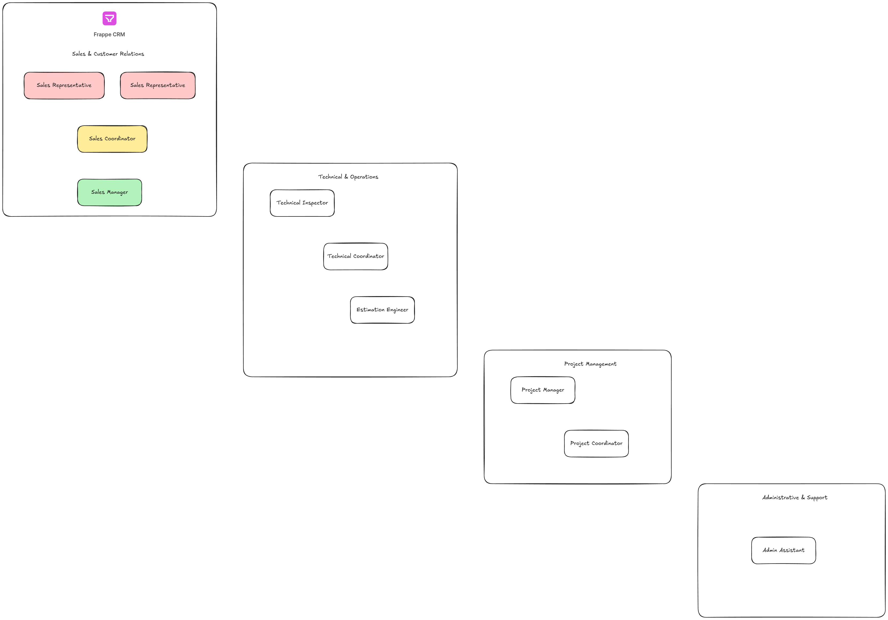

# EITS Role Definitions and Responsibilities

## Table of Contents

1. [Role Overview](#role-overview)
2. [Sales & Customer Relations](#sales--customer-relations)
3. [Technical & Operations](#technical--operations)
4. [Project Management](#project-management)
5. [Administrative & Support](#administrative--support)
6. [Management & Oversight](#management--oversight)
7. [Role Access Matrix](#role-access-matrix)
8. [Workflow Responsibilities](#workflow-responsibilities)
9. [Communication Hierarchy](#communication-hierarchy)

---

## Role Overview

The EITS ERP system requires clearly defined roles to manage the complete business cycle from lead generation to project completion. Each role has specific responsibilities, system access levels, and workflow participation.

### Business Process Flow

```
Lead Generation → Enquiry Processing → Site Assessment → Quotation → Project Execution → Completion
       ↓              ↓                    ↓            ↓            ↓              ↓
   Sales Rep    →  Sales Coord.    →  Tech Inspector → Sales Mgr → Project Mgr → Admin
```





## Sales & Customer Relations

- [CRM Implementation](../CRM/readme.md)


### 1. Sales Representative

**Primary Responsibilities:**

- Initial customer contact and lead qualification
- Customer relationship building
- Basic requirement gathering
- Follow-up communications
- Customer service support

**Key Activities:**

- Receive and respond to initial enquiries
- Conduct preliminary customer interviews
- Schedule site visits and inspections
- Maintain customer communication logs
- Support quotation presentations

**System Access:**

- CRM: Full access to assigned leads/customers
- ERP: Read-only access to quotations and project status
- Communication: Email integration, call logs

**Performance Metrics:**

- Lead response time (target: < 2 hours)
- Lead conversion rate
- Customer satisfaction scores
- Follow-up completion rate

### 2. Sales Coordinator

**Primary Responsibilities:**

- Lead distribution and assignment
- Enquiry processing coordination
- Customer database management
- Sales process optimization
- Communication facilitation

**Key Activities:**

- Assign incoming leads to sales representatives
- Monitor enquiry processing timelines
- Coordinate between sales and technical teams
- Maintain customer interaction records
- Generate sales activity reports

**System Access:**

- CRM: Full administrative access
- ERP: Read access to customer and project data
- Reporting: Sales dashboards and analytics

**Performance Metrics:**

- Lead distribution efficiency
- Process adherence rates
- Team coordination effectiveness
- Data accuracy maintenance

### 3. Sales Manager

**Primary Responsibilities:**

- Sales team leadership and oversight
- Quotation approval and finalization
- Customer relationship management
- Revenue target achievement
- Strategic sales planning

**Key Activities:**

- Review and approve quotations
- Handle complex customer negotiations
- Monitor sales team performance
- Make pricing decisions
- Manage key customer relationships

**System Access:**

- CRM: Full administrative access
- ERP: Quotation approval workflow access
- Financial: Pricing and margin visibility
- Reporting: Comprehensive sales analytics

**Performance Metrics:**

- Revenue achievement
- Team performance management
- Quotation approval turnaround
- Customer retention rates

## Technical & Operations

### 4. Technical Inspector

**Primary Responsibilities:**

- Site visits and technical assessments
- Measurement collection and documentation
- Technical requirement analysis
- Risk assessment and identification
- Site condition reporting

**Key Activities:**

- Conduct detailed site inspections
- Take precise measurements and photographs
- Assess technical feasibility
- Identify potential challenges and risks
- Prepare detailed technical reports
- Provide input for accurate quotation

**System Access:**

- CRM: Site visit scheduling and reporting
- ERP: Technical specification input
- Mobile: Field data collection app
- Document: Photo and report uploads

**Performance Metrics:**

- Site visit completion time
- Measurement accuracy
- Report quality and completeness
- Risk identification effectiveness

**Required Skills:**

- Technical knowledge of MEP systems
- Measurement and assessment expertise
- Documentation and reporting skills
- Problem-solving abilities

### 5. Technical Coordinator

**Primary Responsibilities:**

- Site visit scheduling and coordination
- Technical team resource allocation
- Quality assurance of technical assessments
- Technical documentation management
- Cross-project technical coordination

**Key Activities:**

- Schedule and assign site visits
- Review technical reports for completeness
- Coordinate with project management
- Maintain technical standards
- Manage technical team workload

**System Access:**

- CRM: Site visit management
- ERP: Technical data oversight
- Scheduling: Resource allocation tools
- Quality: Technical review workflows

**Performance Metrics:**

- Site visit scheduling efficiency
- Technical report quality scores
- Resource utilization rates
- Technical standard compliance

### 6. Estimation Engineer

**Primary Responsibilities:**

- Detailed cost estimation and analysis
- Bill of Materials (BOM) preparation
- Technical specification review
- Cost optimization recommendations
- Quotation technical input

**Key Activities:**

- Analyze technical requirements
- Prepare detailed BOMs
- Calculate material and labor costs
- Apply risk and wastage factors
- Review quotation technical accuracy
- Suggest cost optimization opportunities

**System Access:**

- ERP: Full BOM and costing access
- CRM: Technical requirement access
- Pricing: Cost database and calculators
- Reports: Cost analysis tools

**Performance Metrics:**

- Estimation accuracy
- BOM completeness
- Cost optimization suggestions
- Quotation turnaround time

## Project Management

### 7. Project Manager

**Primary Responsibilities:**

- End-to-end project execution
- Resource planning and allocation
- Timeline management and monitoring
- Quality control and assurance
- Client communication during execution

**Key Activities:**

- Develop project execution plans
- Coordinate with suppliers and subcontractors
- Monitor project progress and milestones
- Manage project budgets and costs
- Ensure quality standards compliance
- Handle project-related customer communications

**System Access:**

- ERP: Full project management access
- CRM: Customer communication tools
- Financial: Budget and cost tracking
- Scheduling: Resource and timeline management

**Performance Metrics:**

- Project completion on time
- Budget adherence
- Quality compliance rates
- Customer satisfaction during execution

### 8. Project Coordinator

**Primary Responsibilities:**

- Project administrative support
- Documentation management
- Communication facilitation
- Progress tracking and reporting
- Resource coordination assistance

**Key Activities:**

- Maintain project documentation
- Schedule project meetings and reviews
- Track project milestones and deliverables
- Coordinate between project stakeholders
- Prepare project status reports

**System Access:**

- ERP: Project tracking and reporting
- Document: Project file management
- Communication: Meeting and status tools
- Reporting: Progress dashboards

**Performance Metrics:**

- Documentation completeness
- Communication effectiveness
- Reporting accuracy and timeliness
- Coordination efficiency

## Administrative & Support

### 9. Admin Assistant

**Primary Responsibilities:**

- General administrative support
- Document management and filing
- Customer service support
- Data entry and maintenance
- Office coordination activities

**Key Activities:**

- Handle routine customer inquiries
- Maintain customer and project records
- Support document preparation
- Coordinate office activities
- Assist with data entry tasks

**System Access:**

- CRM: Basic customer service access
- ERP: Data entry and basic reporting
- Document: File management access
- Communication: Customer service tools

**Performance Metrics:**

- Data accuracy rates
- Response time to inquiries
- Document organization efficiency
- Administrative task completion

### 10. Accounts Executive

**Primary Responsibilities:**

- Financial transaction processing
- Invoice generation and management
- Payment tracking and follow-up
- Financial reporting support
- Customer payment coordination

**Key Activities:**

- Generate and send invoices
- Track payment status
- Follow up on overdue payments
- Maintain financial records
- Support financial reporting
- Handle payment-related customer queries

**System Access:**

- ERP: Full financial module access
- CRM: Payment status updates
- Reporting: Financial dashboards
- Communication: Payment follow-up tools

**Performance Metrics:**

- Invoice accuracy and timeliness
- Payment collection efficiency
- Financial data accuracy
- Customer payment satisfaction

## Management & Oversight

### 11. Operations Manager

**Primary Responsibilities:**

- Overall operational oversight
- Process optimization and improvement
- Team coordination and management
- Performance monitoring and analysis
- Strategic operational planning

**Key Activities:**

- Monitor overall business operations
- Analyze process efficiency and effectiveness
- Coordinate between different departments
- Review and approve operational decisions
- Implement process improvements

**System Access:**

- ERP: Full administrative access
- CRM: Complete oversight access
- Analytics: Business intelligence tools
- Reporting: Executive dashboards

**Performance Metrics:**

- Overall operational efficiency
- Process improvement implementations
- Team performance management
- Business KPI achievement

### 12. General Manager

**Primary Responsibilities:**

- Strategic business oversight
- Key decision making authority
- Customer relationship management (VIP)
- Business performance monitoring
- Strategic planning and direction

**Key Activities:**

- Make final business decisions
- Handle VIP customer relationships
- Review business performance
- Set strategic direction
- Approve major quotations and contracts

**System Access:**

- Full system administrative access
- Executive reporting and analytics
- Strategic planning tools
- Business intelligence dashboards

**Performance Metrics:**

- Business growth and profitability
- Strategic goal achievement
- Key customer relationship management
- Overall company performance

## Role Access Matrix

| Role                  | CRM Access          | ERP Access         | Financial Access | Reporting Access    | Mobile Access |
| --------------------- | ------------------- | ------------------ | ---------------- | ------------------- | ------------- |
| Sales Rep             | Lead Management     | Read-only          | None             | Basic Sales         | Yes           |
| Sales Coordinator     | Full CRM Admin      | Customer Data      | None             | Sales Reports       | Limited       |
| Sales Manager         | Full CRM Admin      | Quotation Approval | Pricing/Margins  | Advanced Sales      | Yes           |
| Technical Inspector   | Site Visit Module   | Tech Specs Input   | None             | Technical Reports   | Yes           |
| Technical Coordinator | Site Management     | Tech Oversight     | None             | Technical Analytics | Limited       |
| Estimation Engineer   | Requirements Access | Full BOM/Costing   | Cost Data        | Cost Analysis       | Limited       |
| Project Manager       | Customer Comm       | Full Project       | Budget Tracking  | Project Reports     | Yes           |
| Project Coordinator   | Project Updates     | Project Tracking   | None             | Progress Reports    | Limited       |
| Admin Assistant       | Basic Customer      | Data Entry         | None             | Basic Reports       | No            |
| Accounts Executive    | Payment Updates     | Full Financial     | Full Financial   | Financial Reports   | Limited       |
| Operations Manager    | Full Admin          | Full Admin         | Management View  | All Reports         | Yes           |
| General Manager       | Full Admin          | Full Admin         | Full Access      | Executive Dashboard | Yes           |

## Workflow Responsibilities

### Lead to Enquiry Process

1. **Sales Rep**: Receives and qualifies lead
2. **Sales Coordinator**: Assigns and tracks progress
3. **Sales Rep**: Gathers detailed requirements
4. **Technical Inspector**: Schedules site visit (if needed)

### Site Assessment Workflow

1. **Technical Coordinator**: Coordinates site visit scheduling
2. **Technical Inspector**: Conducts site visit and assessment
3. **Technical Inspector**: Prepares detailed technical report
4. **Estimation Engineer**: Reviews technical data for costing

### Quotation Development

1. **Estimation Engineer**: Prepares detailed cost analysis
2. **Sales Rep**: Compiles customer-facing quotation
3. **Sales Manager**: Reviews and approves quotation
4. **Sales Rep**: Presents quotation to customer

### Project Execution

1. **Project Manager**: Takes ownership after contract signing
2. **Project Coordinator**: Supports project administration
3. **Accounts Executive**: Handles invoicing and payments
4. **Operations Manager**: Monitors overall execution

## Communication Hierarchy

### Internal Escalation Path

```
Sales Rep → Sales Manager → Operations Manager → General Manager
Technical Inspector → Technical Coordinator → Operations Manager
Project Coordinator → Project Manager → Operations Manager
Admin Assistant → Operations Manager
Accounts Executive → Operations Manager
```

### Customer Communication Responsibility

- **Primary Contact**: Sales Representative
- **Technical Queries**: Technical Inspector/Coordinator
- **Pricing Discussions**: Sales Manager
- **Project Execution**: Project Manager
- **Payment Issues**: Accounts Executive
- **Escalation**: Operations Manager/General Manager

### Emergency Contact Protocol

1. **Technical Emergencies**: Technical Coordinator → Operations Manager
2. **Customer Complaints**: Sales Manager → Operations Manager
3. **Financial Issues**: Accounts Executive → Operations Manager
4. **Project Delays**: Project Manager → Operations Manager

---

**Document Version:** 1.0  
**Date:** May 26, 2025  
**Prepared for:** EITS ERP Implementation  
**Status:** Role Definition Complete
