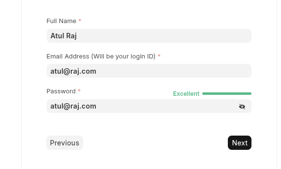

# EITS ERP Implementation Guide

## Table of Contents

1. [Implementation Overview](#implementation-overview)
   - 1.1 [Roles](./Roles/readme.md)
2. [Development Environment Setup](#development-environment-setup)
   - 2.1 [Bench Setup](#bench-setup)
   - 2.2 [ERPNext Installation](#erpnext-installation)
   - 2.3 [CRM Installation](#crm-installation)
3. [CRM Implementation](#crm-implementation)
   - 3.1 [CRM Development Environment](#crm-development-environment)
   - 3.2 [CRM Production Deployment](#crm-production-deployment)
4. [Integration Layer](#integration-layer)
   - 4.1 [The Bridge - CRM to ERPNext](#the-bridge---crm-to-erpnext)
5. [ERPNext Implementation](#erpnext-implementation)
   - 5.1 [ERP Development Environment](#erp-development-environment)
   - 5.2 [ERP Production Deployment](#erp-production-deployment)
6. [Implementation Timeline](#implementation-timeline)
7. [Environment Management](#environment-management)
8. [Testing Strategy](#testing-strategy)
9. [Deployment Pipeline](#deployment-pipeline)
10. [Documentation Structure](#documentation-structure)

---

## Implementation Overview

The EITS ERP solution will be implemented using Frappe's ERPNext and CRM modules, following a structured development approach with separate environments for development, staging, and production.

### Architecture Overview

```
Development Environment (Bench)
├── ERPNext Installation
├── CRM Installation
└── Custom Apps & Integrations

Production Environment
├── CRM Production Instance
├── ERPNext Production Instance
└── Integration Bridge
```

### Implementation Strategy

- **Modular Approach:** Separate CRM and ERP implementations
- **Phased Deployment:** CRM first, then ERPNext, followed by integration
- **Environment Separation:** Development → Staging → Production
- **Documentation-Driven:** Each component documented separately

## Development Environment Setup

### Bench Setup

#### Prerequisites

- Ubuntu 20.04 LTS or later
- Python 3.8+
- Node.js 16+
- MariaDB 10.3+
- Redis
- Git

#### Installation Steps

1. **Install Bench**

   ```bash
   sudo apt update
   sudo apt install python3-pip
   pip3 install frappe-bench
   ```

2. **Initialize Bench**

   ```bash
   bench init frappe-bench --frappe-branch version-14
   cd frappe-bench
   ```

3. **Setup Environment**
   ```bash
   bench setup socketio
   bench setup supervisor
   bench setup nginx
   ```

#### Reference Documentation

- **File:** `01-bench-setup.md`
- **Content:** Detailed bench installation and configuration

### ERPNext Installation

#### Installation Process

1. **Get ERPNext App**

   ```bash
   bench get-app erpnext --branch version-14
   ```

2. **Create Site**

   ```bash
   bench new-site eits-erp.local
   bench --site eits-erp.local install-app erpnext
   ```

3. **Setup Administrator**
   ```bash
   bench --site eits-erp.local set-admin-password [password]
   ```

#### Reference Documentation

- **File:** `02-erpnext-installation.md`
- **Content:** Complete ERPNext setup, configuration, and initial customizations

### CRM Installation

#### Installation Process

1. **Get CRM App**

   ```bash
   bench get-app crm --branch main
   ```

2. **Install on Site**

   ```bash
   bench --site eits-erp.local install-app crm
   ```

3. **Configure CRM**
   ```bash
   bench --site eits-erp.local migrate
   bench restart
   ```

#### Reference Documentation

- **File:** `03-crm-installation.md`
- **Content:** CRM installation, basic configuration, and initial setup

## CRM Implementation

### CRM Development Environment

#### Custom App Development

1. **Create Custom CRM App**

   ```bash
   bench new-app eits_crm
   bench --site eits-erp.local install-app eits_crm
   ```

2. **Development Structure**
   ```
   eits_crm/
   ├── eits_crm/
   │   ├── lead_management/
   │   ├── quotation_system/
   │   ├── customer_portal/
   │   └── site_visit_tracking/
   ```

#### Key Development Areas

- **Lead Management System**
- **Enquiry Processing Workflow**
- **Site Visit Scheduling**
- **Customer Communication Hub**
- **Quotation Generation**

#### Reference Documentation

- **File:** `04-crm-development.md`
- **Content:** Custom CRM development, workflows, and features

### CRM Production Deployment

#### Production Environment Setup

1. **Server Provisioning**
2. **SSL Certificate Configuration**
3. **Domain Setup**
4. **Database Migration**
5. **User Access Configuration**

#### Go-Live Checklist

- [ ] Data migration completed
- [ ] User accounts created
- [ ] Permissions configured
- [ ] Email integration tested
- [ ] Backup procedures verified

#### Reference Documentation

- **File:** `05-crm-production.md`
- **Content:** Production deployment, configuration, and maintenance

## Integration Layer

### The Bridge - CRM to ERPNext

#### Integration Architecture

```
CRM System → API Bridge → ERPNext System
    ↓           ↓            ↓
Leads →    Data Sync  →   Customers
Quotes →   Workflow   →   Quotations
Projects → Management →   Projects
```

#### Key Integration Points

1. **Lead to Customer Conversion**
2. **Quotation Synchronization**
3. **Project Information Transfer**
4. **Document Management**
5. **Financial Data Integration**

#### Development Components

- **API Endpoints**
- **Data Transformation Scripts**
- **Webhook Handlers**
- **Sync Schedulers**
- **Error Handling Systems**

#### Reference Documentation

- **File:** `06-integration-bridge.md`
- **Content:** API development, data synchronization, and workflow automation

## ERPNext Implementation

### ERP Development Environment

#### Custom ERPNext Development

1. **Manufacturing Module Customization**
2. **Project Management Enhancement**
3. **Financial Integration**
4. **Inventory Management**
5. **Custom Reports and Dashboards**

#### Development Areas

- **BOM Management System**
- **Cost Calculation Engine**
- **Project Tracking Dashboard**
- **Custom Item Coding**
- **Risk and Wastage Calculations**

#### Reference Documentation

- **File:** `07-erpnext-development.md`
- **Content:** ERPNext customizations, custom doctypes, and business logic

### ERP Production Deployment

#### Production Setup

1. **High Availability Configuration**
2. **Database Optimization**
3. **Performance Tuning**
4. **Security Hardening**
5. **Monitoring Setup**

#### Production Checklist

- [ ] Master data imported
- [ ] Chart of accounts configured
- [ ] Item masters created
- [ ] User roles defined
- [ ] Integration tested

#### Reference Documentation

- **File:** `08-erpnext-production.md`
- **Content:** Production deployment, optimization, and monitoring

## Implementation Timeline

### Phase 1: Foundation (Weeks 1-2)

- Development environment setup
- Basic installations completed
- Initial configurations done

### Phase 2: CRM Development (Weeks 3-6)

- Custom CRM development
- Workflow implementation
- Testing and refinement

### Phase 3: CRM Production (Week 7)

- Production deployment
- User training
- Go-live support

### Phase 4: Integration Development (Weeks 8-10)

- API development
- Data synchronization
- Integration testing

### Phase 5: ERPNext Development (Weeks 11-14)

- Custom module development
- Business logic implementation
- Testing and validation

### Phase 6: ERP Production (Week 15)

- Production deployment
- Final integration
- System handover

## Environment Management

### Development Environment

- **Purpose:** Feature development and testing
- **Access:** Development team only
- **Data:** Sample/test data
- **Updates:** Frequent, automated

### Staging Environment

- **Purpose:** User acceptance testing
- **Access:** EITS team and testers
- **Data:** Production-like data
- **Updates:** Controlled releases

### Production Environment

- **Purpose:** Live business operations
- **Access:** End users only
- **Data:** Live business data
- **Updates:** Scheduled releases

## Testing Strategy

### Unit Testing

- Individual component testing
- Custom function validation
- API endpoint testing

### Integration Testing

- CRM to ERPNext data flow
- Workflow automation testing
- Third-party integrations

### User Acceptance Testing

- Business process validation
- User interface testing
- Performance validation

### Load Testing

- System performance under load
- Database optimization
- Response time validation

## Deployment Pipeline

### Automated Deployment Process

1. **Code Commit** → Git repository
2. **Automated Testing** → CI/CD pipeline
3. **Staging Deployment** → Testing environment
4. **User Acceptance** → Business validation
5. **Production Deployment** → Live environment

### Rollback Strategy

- Database backup procedures
- Code version management
- Quick rollback mechanisms
- Emergency procedures

## Documentation Structure

### Individual Documentation Files

1. **`01-bench-setup.md`** - Complete bench installation guide
2. **`02-erpnext-installation.md`** - ERPNext setup and configuration
3. **`03-crm-installation.md`** - CRM installation and setup
4. **`04-crm-development.md`** - Custom CRM development guide
5. **`05-crm-production.md`** - CRM production deployment
6. **`06-integration-bridge.md`** - Integration development guide
7. **`07-erpnext-development.md`** - ERPNext customization guide
8. **`08-erpnext-production.md`** - ERPNext production deployment
9. **`09-testing-procedures.md`** - Testing methodologies and checklists
10. **`10-maintenance-guide.md`** - System maintenance and monitoring

### Documentation Standards

- Each file follows consistent structure
- Code examples included where applicable
- Screenshots and diagrams for complex procedures
- Troubleshooting sections included
- Version control for all documentation

---

**Document Version:** 1.0  
**Date:** May 26, 2025  
**Implementation Team:** EITS ERP Development  
**Status:** Implementation Ready

## Implementing the Custom Quotation

Here we will addressing 2 approaches:

1. [BOM Based Approach](./BOM.md)
2. [Project based Approach](./Project%20Approach/readme.md)
3. [Printing](./Printing/Printing.md)
4. [Inventory Management](../Inventory/Inventory.md)

# Development Site Credentials

site: erp.eitc.com
administrator: erpeitc


