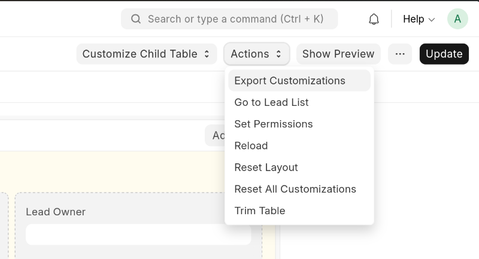

# Changes in Frappe

## Table of Contents
1. [3.1 Custom DocTypes](#31-custom-doctypes)
   - [Export](#export)
   - [Import](#import)
2. [3.2 Fixtures](#32-fixtures)
   - [Configuration](#configuration)
   - [Export Command](#export-command)
3. [3.3 Customizations](#33-customizations)
   - [Web App Customization](#web-app-customization)
   - [Migration Note](#migration-note)

---

## 3.1 Custom DocTypes
<a id="31-custom-doctypes"></a>

### Export
<a id="export"></a>
1. Create doctype  
2. Choose module (e.g., Eits App)  

```bash
bench --site [site-name] export-doc "DocType" "DocType Name"
```

### Import
<a id="import"></a>
- **First time installation**: All changes are imported during app installation  
- **Already installed app**:  
  1. Go to app directory  
  2. Check branch  
  3. Run `git pull`  
  4. Execute migration:  

```bash
bench --site [site-name] migrate
```

---

## 3.2 Fixtures
<a id="32-fixtures"></a>

### Configuration
<a id="configuration"></a>
Edit `hooks.py` (located at `apps/eits_app/eits_app/hooks.py`):  

```python
fixtures = [
    {
        "dt": "Dashboard",
        "filters": [["name", "in", ["Project Approval Dashboard"]]]
    },
    {
        "dt": "Dashboard Chart",
        "filters": [["name", "in", ["Project Approval Status"]]]
    },
    {
        "dt": "Report",
        "filters": [["ref_doctype", "=", "Project"]]
    },
    {
        "dt": "Client Script",
        "filters": [["module", "=", "Eits App"]]
    },
    "Server Script",
    "Client Script"
]
```

### Export Command
<a id="export-command"></a>
```bash
bench --site [site-name] export-fixtures
```

---

## 3.3 Customizations
<a id="33-customizations"></a>

### Web App Customization
<a id="web-app-customization"></a>
1. Access the web app  
2. Select module to export  
   

### Migration Note
<a id="migration-note"></a>
Customizations are imported after migration. Run:  

```bash
bench --site [site-name] migrate
```


### [Back to Workflow](../readme.md)